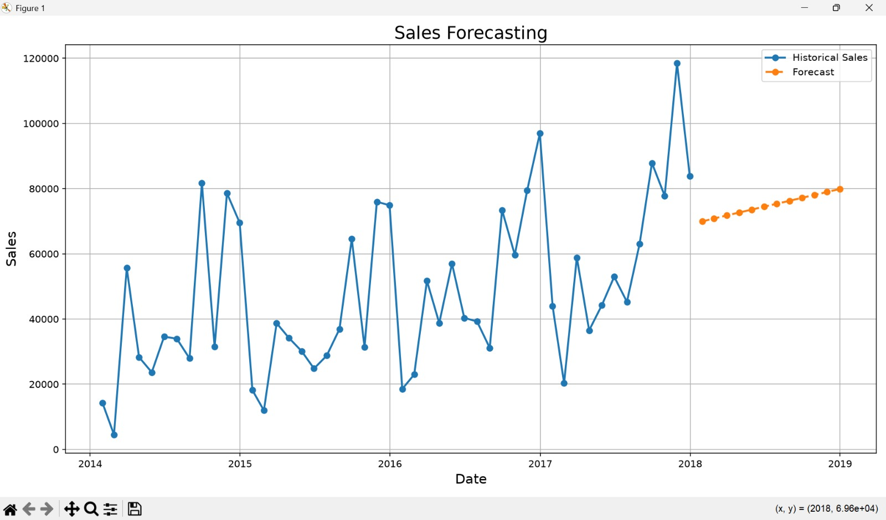

# Sales & Demand Forecasting for Businesses

## Objective
Build a machine learning model to forecast future sales using historical business data.

## Tools Used
- Python
- Pandas
- NumPy
- Scikit-Learn
- Matplotlib

## Features
- Data Cleaning
- Feature Engineering
- Sales Forecasting
- Forecast Visualization
- Business Insights

## Forecast Graph

## Output Table

## Conclusion
The model successfully predicts future sales trends and helps businesses make data-driven decisions.
