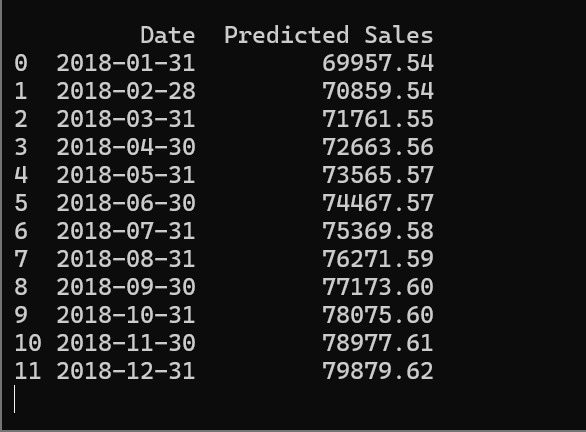

# Sales & Demand Forecasting for Businesses

## Objective
Build a machine learning model to forecast future sales using historical business data.

___

## Tools Used
- Python
- Pandas
- NumPy
- Scikit-Learn
- Matplotlib
___

## Features
- Data Cleaning
- Feature Engineering
- Sales Forecasting
- Forecast Visualization
- Business Insights
____

## Forecast Graph

## Output Table

___

## Conclusion
The model successfully predicts future sales trends and helps businesses make data-driven decisions.
